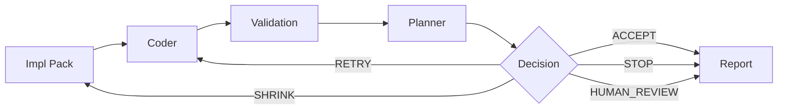

# EverRun

**A bounded run, not a free-for-all.**

Coding agents can write code.
EverRun decides whether the run can continue.

Scope. Validation. Judgment. Evidence.

[everrun.ailuros.io](https://everrun.ailuros.io)

---

## What EverRun does

EverRun runs coding agents inside a bounded task.

It takes an **Impl Pack**, lets a coder implement it, runs validation, then asks a planner to decide:

```text
ACCEPT · RETRY · SHRINK · STOP · HUMAN_REVIEW
```

No validation, no accept.

---

## Run flow



---

## Quick start

Install EverRun:

```bash
pip install everrun-0.1.0-py3-none-any.whl
```

Initialize your project:

```bash
cd your-project
everrun init
everrun demo
```

Run a real task:

```bash
everrun pack-shape start
everrun run
everrun report
```

---

## What you get

Code changed.
Validation checked.
Decision made.
Evidence written.

| Output         | Meaning                                 |
| -------------- | --------------------------------------- |
| Changed files  | exactly what was touched                |
| Validation     | tests · typecheck · lint                |
| Decision       | accept · retry · shrink · stop · review |
| Scope judgment | stayed within bounds?                   |
| Report         | full run on disk                        |

---

## What EverRun is not

EverRun is not a general agent platform.

It is not:

* an infinite self-healing loop
* a background daemon
* a multi-agent playground
* a replacement for engineering judgment

EverRun runs one scoped task, checks the result, and forces a decision.

That narrowness is the product.

---

## Docs

Start here:

* [Getting Started](docs/getting-started.md)
* [Install](docs/install.md)
* [Shape](docs/shape.md)
* [Run](docs/run.md)

Reference:

* [Configuration](docs/configuration.md)
* [Troubleshooting](docs/troubleshooting.md)
* [Impl Pack Schema](docs/impl-pack-schema.md)
* [Example Pack](examples/example-greeting-cli.todo.json)

---

## Status

Private Alpha RC.

EverRun orchestrates external coding CLIs such as OpenCode, Codex, and Claude Code.
It does not include a model runtime.
